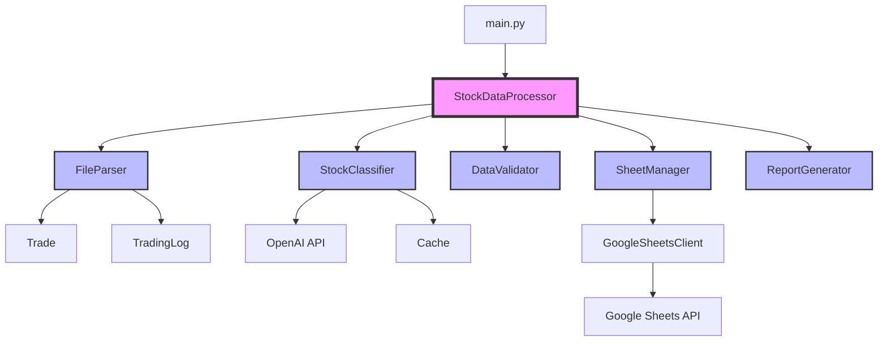
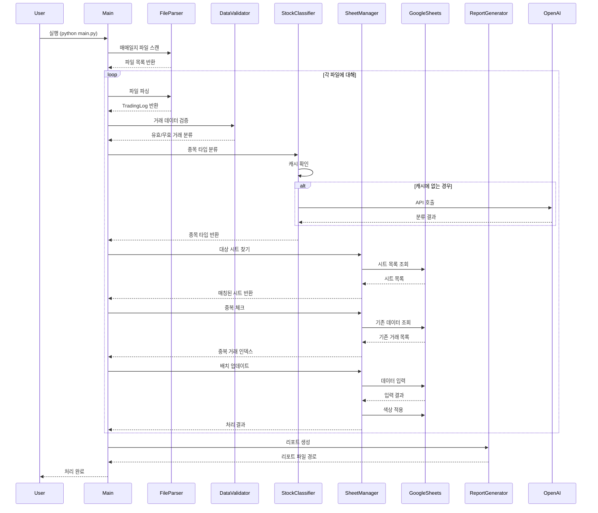
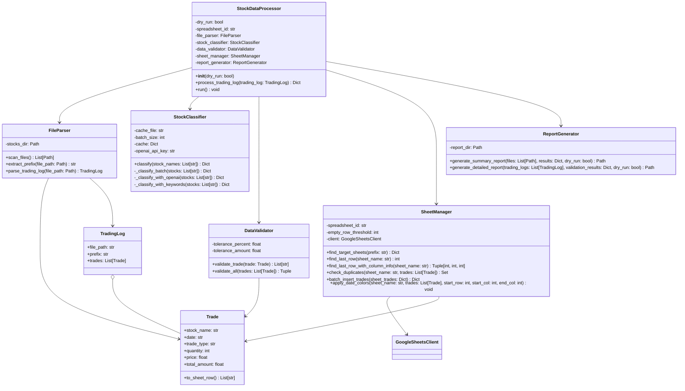
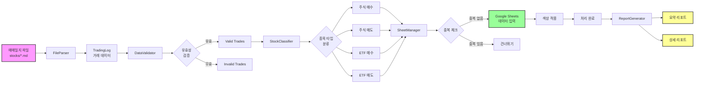

# 주식 매매일지 구글 시트 자동 입력 시스템 PRD

## 1. 개요

### 1.1 프로젝트 목적
주식 매매일지 파일을 자동으로 파싱하여 구글 시트에 입력하는 시스템을 구축합니다. 수동으로 구글 시트에 입력하는 번거로움을 해소하고, 데이터 입력의 정확성을 높이며, 시간을 절약합니다.

### 1.2 주요 기능
- 매매일지 파일 자동 파싱
- 종목 타입 자동 분류 (주식/ETF)
- 구글 시트 자동 입력
- 중복 거래 체크
- 날짜별 색상 구분
- 처리 결과 리포트 생성

## 2. 시스템 아키텍처

### 2.1 프로젝트 구조
```
google-sheet/
├── main.py                     # 메인 실행 파일
├── test_main.py               # 테스트 파일
├── modules/                   # 핵심 모듈 패키지
│   ├── __init__.py
│   ├── file_parser.py         # 파일 파싱 모듈
│   ├── stock_classifier.py    # 종목 분류 모듈
│   ├── data_validator.py      # 데이터 검증 모듈
│   ├── sheet_manager.py       # Google Sheets 관리 모듈
│   ├── report_generator.py    # 리포트 생성 모듈
│   └── google_sheets_client.py # Google Sheets API 클라이언트
├── config/
│   └── config.yaml            # 설정 파일
├── stocks/                    # 매매일지 파일 디렉토리
├── reports/                   # 생성된 리포트 디렉토리
├── logs/                      # 로그 파일 디렉토리
├── docs/                      # 문서 디렉토리
├── stock_type_cache.json      # 종목 타입 캐시
└── requirements.txt           # 의존성 패키지
```

### 2.2 모듈 구조
시스템은 다음과 같은 모듈로 구성됩니다:

- **main.py**: 전체 프로세스를 조율하는 StockDataProcessor 클래스
- **FileParser**: 매매일지 파일 파싱
- **StockClassifier**: 종목의 주식/ETF 분류
- **DataValidator**: 거래 데이터 유효성 검증
- **SheetManager**: Google Sheets 작업 관리
- **ReportGenerator**: 처리 결과 리포트 생성
- **GoogleSheetsClient**: Google Sheets API 통신

### 2.3 처리 흐름
1. 매매일지 파일 스캔 및 파싱
2. 거래 데이터 유효성 검증
3. 종목 타입 분류 (캐시 → OpenAI API → 키워드 폴백)
4. 대상 시트 찾기 및 중복 체크
5. 배치 데이터 입력 및 색상 적용
6. 처리 결과 리포트 생성

## 3. 핵심 모듈 설명

### 3.1 FileParser (file_parser.py)
- **책임**: 매매일지 파일 파싱
- **주요 클래스**:
  - `Trade`: 개별 거래 정보 데이터 클래스
  - `TradingLog`: 매매일지 파일 정보
  - `FileParser`: 파일 파싱 로직
- **기능**:
  - stocks 폴더의 .md 파일 스캔
  - 행별 거래 내역 파싱 (각 행에 일자 포함)
  - 날짜 형식 변환 (YYYY/MM/DD → YYYY-MM-DD)
  - Trade 객체로 변환

### 3.2 StockClassifier (stock_classifier.py)
- **책임**: 종목의 주식/ETF 분류
- **주요 기능**:
  - 캐시 기반 빠른 조회
  - OpenAI API를 통한 정확한 분류
  - 키워드 기반 폴백 로직
- **특징**:
  - 배치 처리로 API 호출 최소화
  - 분류 결과 캐싱으로 성능 향상

### 3.3 DataValidator (data_validator.py)
- **책임**: 거래 데이터 유효성 검증
- **검증 항목**:
  - 날짜 형식 (YYYY-MM-DD)
  - 수량/가격 양수 체크
  - 총액 계산 검증 (오차 허용: 0.1% 또는 10원)
  - 거래 타입 (매수/매도)

### 3.4 SheetManager (sheet_manager.py)
- **책임**: Google Sheets 작업 관리
- **주요 기능**:
  - 대상 시트 찾기 (계좌별 매수/매도 시트)
  - 마지막 데이터 행 찾기
  - 중복 거래 체크
  - 배치 데이터 입력
  - 날짜별 색상 적용
- **특징**:
  - 비동기 처리로 성능 최적화
  - 재시도 로직으로 안정성 확보

### 3.5 ReportGenerator (report_generator.py)
- **책임**: 처리 결과 리포트 생성
- **리포트 종류**:
  - 요약 리포트: 전체 처리 결과 요약
  - 상세 리포트: 파일별 처리 내역 및 검증 결과
- **특징**:
  - 타임스탬프 기반 파일명
  - 드라이런 모드 표시

### 3.6 GoogleSheetsClient (google_sheets_client.py)
- **책임**: Google Sheets API와의 직접적인 통신
- **주요 기능**:
  - 서비스 계정 인증
  - 시트 데이터 읽기/쓰기
  - 배치 업데이트
  - 색상 적용
- **특징**:
  - 비동기 컨텍스트 매니저 지원
  - GridData 형식 처리

## 4. 데이터 흐름

### 4.1 입력 데이터 형식

```markdown
일자	종목명	기간 중 매수			기간 중 매도			매매비용	손익금액	수익률
		수량	평균단가	매수금액	수량	평균단가	매도금액
2025/06/20	TIGER 화장품	2	4050	8100	0	0	0	0	0	0.00
2025/06/20	TIGER 반도체	2	36690	73380	0	0	0	0	0	0.00
2025/06/20	카카오	0	0	0	27	63588	1716900	2885	210874	14.00
2025/06/20	NAVER	0	0	0	23	265586	6108500	12863	1229113	25.19
```

**데이터 형식 특징:**
- 각 행에 거래 일자 포함 (YYYY/MM/DD 형식)
- 헤더가 2줄로 구성 (대분류 + 세부 필드)
- 한 행에 매수와 매도 정보가 모두 포함
- 매매비용, 손익금액, 수익률 정보 추가
- 탭(Tab)으로 구분된 데이터

### 4.2 Google Sheets 출력 형식
| 종목 | 증권 | 일자 | 구분 | 평균단가 | 수량 | 수수료 | 총액 | 메모 |
|------|------|------|------|----------|------|--------|------|------|
| 삼성전자 | 미래에셋증권 | 2025-06-20 | 매수 | ₩50,000 | 100 | | ₩5,000,000 | |

**참고사항:**
- 증권사 정보는 입력 데이터에 없으므로 고정값("미래에셋증권")으로 설정
- 수수료는 빈 값으로 처리
- 일자는 YYYY-MM-DD 형식으로 변환하여 저장

## 5. 설정 파일 (config.yaml)

```yaml
google_sheets:
  spreadsheet_id: "YOUR_SPREADSHEET_ID"
  service_account_path: "path/to/service-account.json"

batch_size: 10
empty_row_threshold: 100
stock_type_cache_file: "stock_type_cache.json"

logging:
  level: INFO
```

## 6. 주요 기능 상세

### 6.1 종목 타입 자동 분류
1. **캐시 확인**: 이전에 분류된 종목은 캐시에서 즉시 조회
2. **OpenAI API 활용**: GPT-4를 통한 정확한 분류
3. **키워드 폴백**: API 실패 시 ETF 키워드 기반 분류
4. **캐시 저장**: 분류 결과를 JSON 파일에 저장

### 6.2 중복 거래 방지
- 종목명 + 날짜 조합으로 중복 체크
- 기존 시트 데이터와 비교하여 중복 거래 제외

### 6.3 날짜별 색상 구분
- 같은 날짜의 거래는 동일한 배경색 적용
- 8가지 색상 팔레트 순환 사용
- 시각적으로 거래 날짜 구분 용이

### 6.4 드라이런 모드
- `--dry-run` 옵션으로 실제 입력 없이 시뮬레이션
- 처리될 데이터 미리 확인 가능
- 안전한 테스트 환경 제공

## 7. 사용 방법

### 7.1 기본 실행
```bash
python main.py
```

### 7.2 드라이런 모드
```bash
python main.py --dry-run
```

### 7.3 디버그 모드
```bash
python main.py --log-level DEBUG
```

## 8. 리팩토링 이력

### 8.1 초기 구조의 문제점
- 모든 로직이 `StockDataProcessor` 클래스에 집중
- 단일 책임 원칙 위반
- 테스트 어려움
- 유지보수 복잡성

### 8.2 개선 사항
1. **모듈화**: 기능별로 독립된 모듈 분리
2. **책임 분리**: 각 클래스가 단일 책임만 담당
3. **의존성 주입**: 느슨한 결합 구조
4. **테스트 용이성**: 각 모듈 독립적 테스트 가능
5. **재사용성**: 모듈별 재사용 가능

### 8.3 MCP 제거
- 초기에는 MCP(Model Context Protocol) 사용 시도
- 복잡성과 제한사항으로 인해 제거
- Google Sheets API v4 직접 사용으로 변경
- 더 안정적이고 유연한 구조 확보

### 8.4 데이터 포맷 변경 (2025-06-22)
- 날짜별 섹션 구조에서 행별 일자 포함 구조로 변경
- 헤더가 2줄로 구성 (대분류 + 세부 필드)
- 한 행에 매수/매도 정보 통합
- 매매비용, 손익금액, 수익률 필드 추가
- 증권사 정보 제거 (고정값으로 처리)

## 9. 향후 개선 사항

### 9.1 기능 개선
- [ ] 다양한 증권사 매매일지 형식 지원
- [ ] 실시간 모니터링 대시보드
- [ ] 수익률 자동 계산 및 차트 생성
- [ ] 세금 계산 기능 추가

### 9.2 기술적 개선
- [ ] 단위 테스트 커버리지 확대
- [ ] CI/CD 파이프라인 구축
- [ ] Docker 컨테이너화
- [ ] 에러 복구 메커니즘 강화

## 10. 참고 사항

### 10.1 필수 환경 변수
- `OPENAI_API_KEY`: OpenAI API 키 (선택사항)

### 10.2 Google Sheets 권한
- 서비스 계정에 스프레드시트 편집 권한 필요
- 시트 구조는 미리 정의되어 있어야 함

### 10.3 파일 형식
- 매매일지는 특정 형식의 마크다운 파일
- 탭으로 구분된 데이터 테이블 포함
- 2줄의 헤더 (대분류 + 세부 필드)
- 각 행에 거래 일자와 매수/매도 정보 모두 포함

## 11. 다이어그램

### 11.1 모듈 구조
각 모듈의 의존성과 관계를 보여주는 다이어그램입니다. StockDataProcessor가 중앙에서 모든 모듈을 조율합니다.



### 11.2 처리 시퀀스
전체 처리 과정을 시간 순서대로 보여주는 시퀀스 다이어그램입니다. 사용자가 스크립트를 실행하면 파일 파싱부터 리포트 생성까지의 전체 흐름을 확인할 수 있습니다.



### 11.3 클래스 다이어그램
각 클래스의 속성과 메서드, 그리고 클래스 간의 관계를 보여줍니다.



### 11.4 데이터 플로우
데이터가 시스템을 통해 어떻게 흐르는지 보여주는 다이어그램입니다. 매매일지 파일에서 시작하여 Google Sheets에 입력되고 리포트가 생성되는 전체 과정을 시각화합니다.



